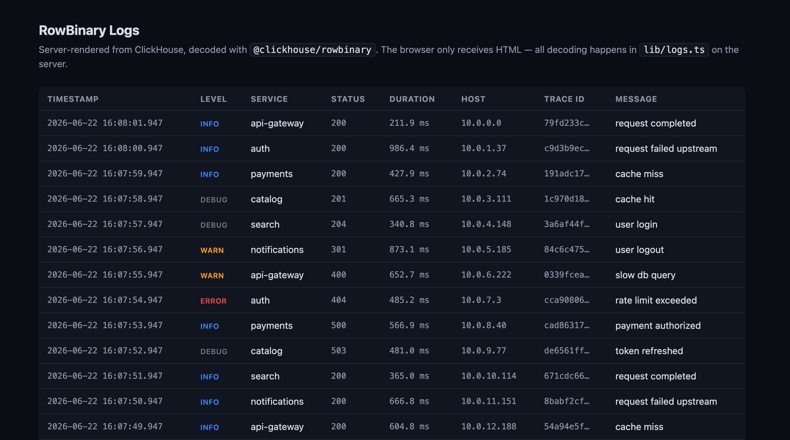

# RowBinary Logs Demo



A tiny, **server-only** Next.js app that pages through a ClickHouse logs table,
decoding each page from `RowBinary` with
[`@clickhouse/rowbinary`](../../). The browser receives only HTML — there are no
client components and no client-side data fetching. All decoding happens on the
server in [`lib/logs.ts`](lib/logs.ts).

It's wired up so you can poke at the decoder yourself: change the schema, the
reader, the page size, or swap the API-combinator reader for a monomorphized one.

## What it shows

The `demo_logs` table is intentionally a mix of types that exercise the
decoder's interesting paths:

| Column        | ClickHouse type           | Decoded as                      |
| ------------- | ------------------------- | ------------------------------- |
| `timestamp`   | `DateTime64(3)`           | JS `Date` (ms-lossless)         |
| `level`       | `Enum8('debug'..'error')` | `number` → name at the edge     |
| `service`     | `LowCardinality(String)`  | plain `String` (transparent)    |
| `host`        | `IPv4`                    | dotted-quad `string`            |
| `trace_id`    | `UUID`                    | canonical `8-4-4-4-12` `string` |
| `status`      | `UInt16`                  | `number`                        |
| `duration_ms` | `Float64`                 | `number`                        |
| `message`     | `String`                  | `string`                        |

The per-column reads live in `readLogRow` in [`lib/logs.ts`](lib/logs.ts) — one
leaf reader per column, in wire order. That's the clear, "correct by default"
combinator form; the comments point at where you'd monomorphize it if this were a
hot path.

## Prerequisites

- Node 18+ (built/tested on Node 24)
- A running ClickHouse. This demo ships a self-contained one — from **this
  directory** (`demo/logs`):

  ```bash
  docker compose up -d
  ```

  That exposes HTTP on `localhost:8123` with the default user and no password.

## Run it

From this directory (`demo/logs`):

```bash
npm install          # installs Next + the local @clickhouse/rowbinary tarball
npm run seed         # create demo_logs and insert 1000 rows (pass a number to change: npm run seed -- 50000)
npm run dev          # http://localhost:3000
```

Then open <http://localhost:3000> and use **Newer / Older** to page through the
logs (25 per page). Pagination is plain `LIMIT`/`OFFSET` driven by the `?page=`
query param.

## Configuration

All connection settings come from the environment (defaults in parentheses):

| Variable              | Default                 |
| --------------------- | ----------------------- |
| `CLICKHOUSE_URL`      | `http://localhost:8123` |
| `CLICKHOUSE_USER`     | `default`               |
| `CLICKHOUSE_PASSWORD` | _(empty)_               |
| `CLICKHOUSE_DATABASE` | `default`               |

## Layout

```
app/
  layout.tsx        root layout + global styles
  page.tsx          the server component: reads ?page, renders the table + pager
  globals.css       styling
lib/
  clickhouse.ts     minimal fetch-based ClickHouse HTTP access (server-only)
  logs.ts           the RowBinary reader + fetchLogsPage()  ← the interesting bit
scripts/
  seed.mjs          standalone seeder (INSERT ... SELECT FROM numbers(N))
vendor/
  clickhouse-rowbinary-0.1.0.tgz   the packed library this demo installs
```

## Updating the library

This app installs `@clickhouse/rowbinary` from the packed tarball in `vendor/`.
To pick up changes you make in the parent package, repack and reinstall — from
the package root (`../../`):

```bash
npm run build && npm pack
cp clickhouse-rowbinary-*.tgz demo/logs/vendor/clickhouse-rowbinary-0.1.0.tgz
cd demo/logs && npm install
```
